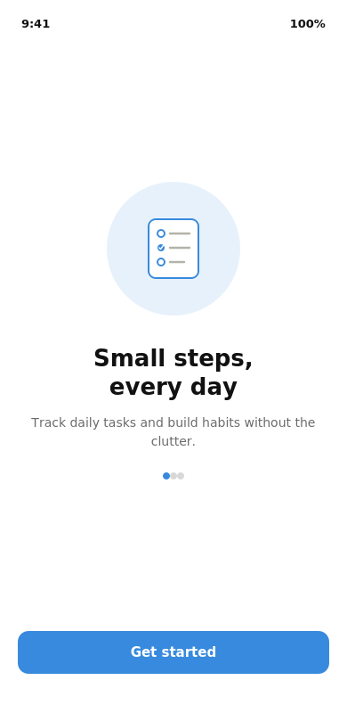
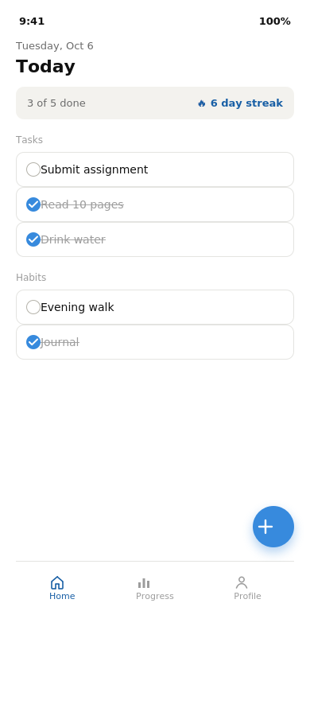
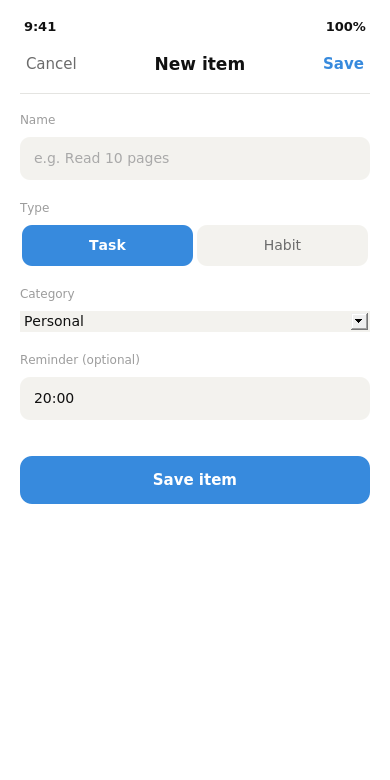
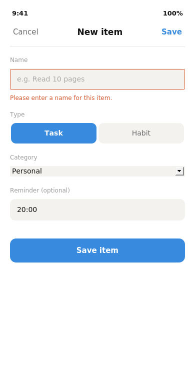
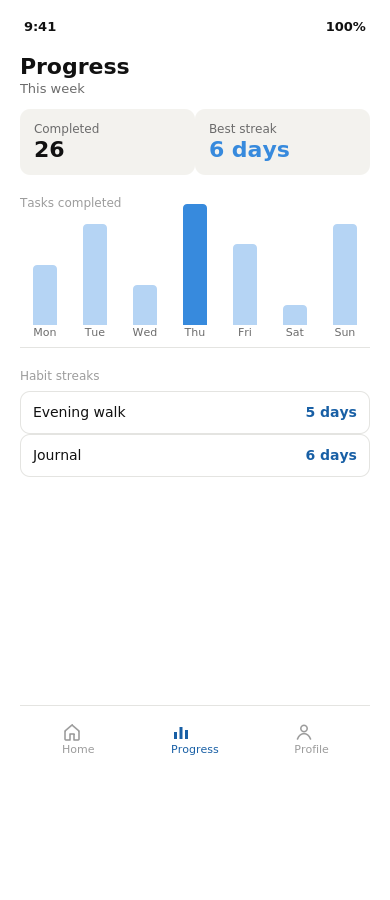
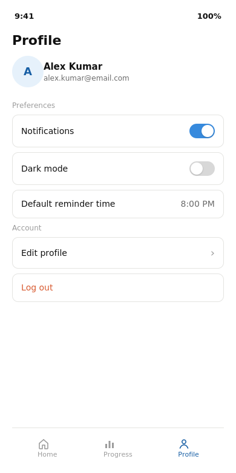

# QuickTask

A daily micro-task and habit tracker, built as a mobile-responsive web app.

**SWYNEX Internship — Final App Project (Task 4)**

QuickTask helps users track small daily to-dos and simple habits — like
"drink water," "read 10 pages," or "submit assignment" — without the
overhead of a full project-management tool.

---

## Screenshots

| Onboarding | Home | Add Task |
|---|---|---|
|  |  |  |

| Validation | Progress | Profile |
|---|---|---|
|  |  |  |

---

## Demo note

QuickTask is a single-page app with five screens: **Onboarding**, **Home**,
**Add Task/Habit**, **Progress**, and **Profile**. From Onboarding, tapping
**Get started** leads to Home, which lists today's tasks and habits as a
checklist. Tapping the floating **+** button opens the Add screen, where a
new task or habit can be created with a name, type, category, and optional
reminder time. The form validates the name field (required, minimum
length, no duplicates) and shows an inline error if the input is invalid.
Saved items appear immediately on Home and persist across page reloads via
`localStorage`. The bottom navigation bar switches between Home, Progress
(a weekly completion chart and habit streaks), and Profile (user info and
settings toggles).

---

## Tech stack

Plain **HTML, CSS, and JavaScript** — no framework, no build step, no
dependencies. This was a deliberate choice so the app can be opened and
reviewed instantly, by anyone, with nothing to install.

## Features

- **5 fully working screens** with real navigation (not static mockups)
- **Create-and-list feature path** — add a task or habit, see it appear on Home instantly
- **Form validation** — required name, minimum length, duplicate detection, all with visible inline error messages
- **Empty states** — friendly messaging when there are no tasks/habits yet
- **Persistent local state** — all data is saved to `localStorage` (key: `quicktask_items_v1`) and survives page reloads
- **Interactive elements throughout** — check off tasks/habits (updates streaks and summary live), toggle settings switches, switch between Task/Habit type when adding an item
- **Responsive layout** — works on both mobile screen sizes and desktop browsers

## Setup instructions

No build tools, package manager, or server required.

### Option 1 — open directly
Double-click `index.html`, or open it from your browser's File menu.

### Option 2 — serve locally (recommended)
```bash
git clone https://github.com/gowthamchatla/SWYNEX-Core-App-Screens.git
cd SWYNEX-Core-App-Screens
python3 -m http.server 8000
```
Then visit `http://localhost:8000` in your browser.

### Option 3 — GitHub Pages
If Pages is enabled on this repo (Settings → Pages → source: `main` branch,
root folder), the live app is available directly at the Pages URL shown in
the repo's "About" section.

## Project structure

```
.
├── index.html          # all 5 screens (markup)
├── css/
│   └── style.css       # styling for all screens
├── js/
│   └── app.js           # navigation, validation, state, and rendering logic
├── screenshots/          # screenshots used in this README
└── README.md
```

## Task progression

| Task | What it covered |
|---|---|
| 1 | App concept and screen flow (design doc) |
| 2 | Core app screens implemented as working HTML/CSS/JS |
| 3 | Added validation, empty states, and confirmed persistent local state |
| 4 | Polish, screenshots, setup instructions, and this documentation |
